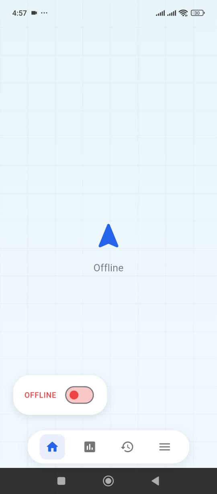
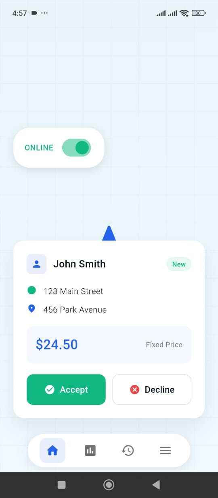
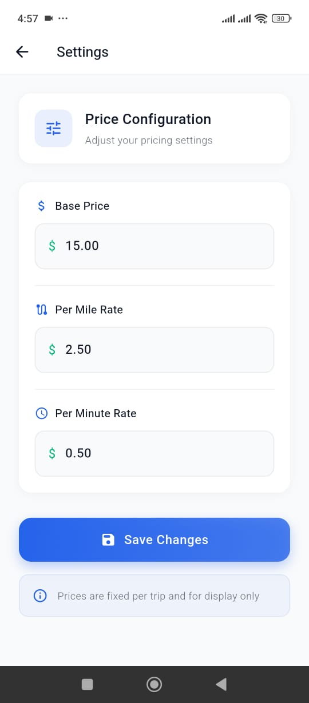

<div align="center">

<br/>

# ▬▬▬▬▬▬▬▬▬▬▬▬▬▬▬▬▬▬▬▬▬▬▬▬▬▬▬▬▬▬

<br/>

# CAREFULLY REVIEWED AND REVISED BY

# A B D E L I L A H &nbsp;&nbsp; A H A R C H A

<br/>

# ▬▬▬▬▬▬▬▬▬▬▬▬▬▬▬▬▬▬▬▬▬▬▬▬▬▬▬▬▬▬

<br/>

</div>

---

# 🚗 Driver Portal — Flutter UI

<div align="center">

A driver-facing mobile app UI built with Flutter.
Clean, modern design with smooth animations and a polished feel.

</div>

---

## 🎬 App Demo

<div align="center">


</div>

---

## 📱 Screenshots

| Home (Offline) | Home (Online) | Active Trip | Settings | Side Drawer |
|:---:|:---:|:---:|:---:|:---:|
|  |  |  |  |  |

---

## ✨ Features

- Shopify-style floating bottom navigation bar
- Online / Offline toggle with smooth animation
- Ride request card that slides up with Accept / Decline
- Route screen with visual A → B map and trip info
- Dark-themed side drawer with Settings and History
- Settings screen with adjustable price configuration
- Smooth page transitions and haptic feedback
- Responsive across all Android screen sizes

---

## 🛠 Tech Stack

| Technology | Purpose |
|---|---|
|  | UI Framework |
|  | Programming language |
|  | Design system |

---

## 📁 Project Structure

```
lib/
├── main.dart
├── constants/
│   └── app_constants.dart       # Colors & mock data
├── screens/
│   ├── home_screen.dart         # Main map screen
│   ├── route_screen.dart        # Active trip screen
│   └── settings_screen.dart     # Price configuration
└── widgets/
    ├── ride_offer_card.dart      # Ride request card
    └── shopify_bottom_nav.dart   # Custom bottom navbar

screenshots/
├── app_video.gif
├── homescreen_offline.jpeg
├── home_screen.jpeg
├── active_trip.jpeg
├── setting.jpeg
└── side_drawer.jpeg
```

---

## ⚡ Getting Started

### 1. Clone the repository

```bash
git clone https://github.com/ABDOU-AHARCHA/Drivier-Portal-UI.git
cd Drivier-Portal-UI
```

### 2. Install dependencies

```bash
flutter pub get
```

### 3. Run the app

```bash
flutter run
```

### 4. Build APK

```bash
flutter build apk --release --split-per-abi
```

---

## 📌 Note

This is a **front-end only** project. All data is mocked.
No backend, no real map integration — built purely to demonstrate UI and navigation skills.

---

## 👤 Author

**Abdelilah Aharcha** – Flutter Developer

---

## 📄 License

This project is licensed under the [MIT License](https://opensource.org/licenses/MIT).
